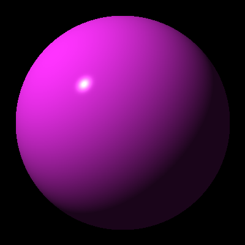
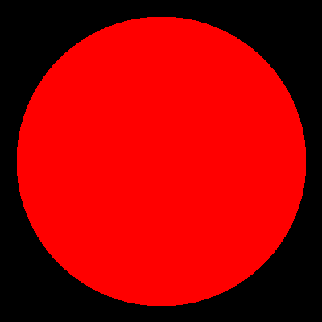

# Test-driven Raytracer

A work-in-progress, test-driven raytracer, based on the book "The Raytracer challenge" by Jamis Buck.

Chapters finished:
1. Tuples, Points and Vectors
2. Drawing on a Canvas
3. Matrices
4. Transforms
5. Ray-Sphere Intersections
6. Light and Shading

---
## Progress report

#### 2/Apr/2023 - First shaded light!

After a bit of a hiatus, here it is in full Phong glory. Look at that specular beauty.

#### 29/Dec/2022 - First light!

Ok, it's not much, just a flat disc that is actually a sphere, but it's the first step showing ray intersections.

